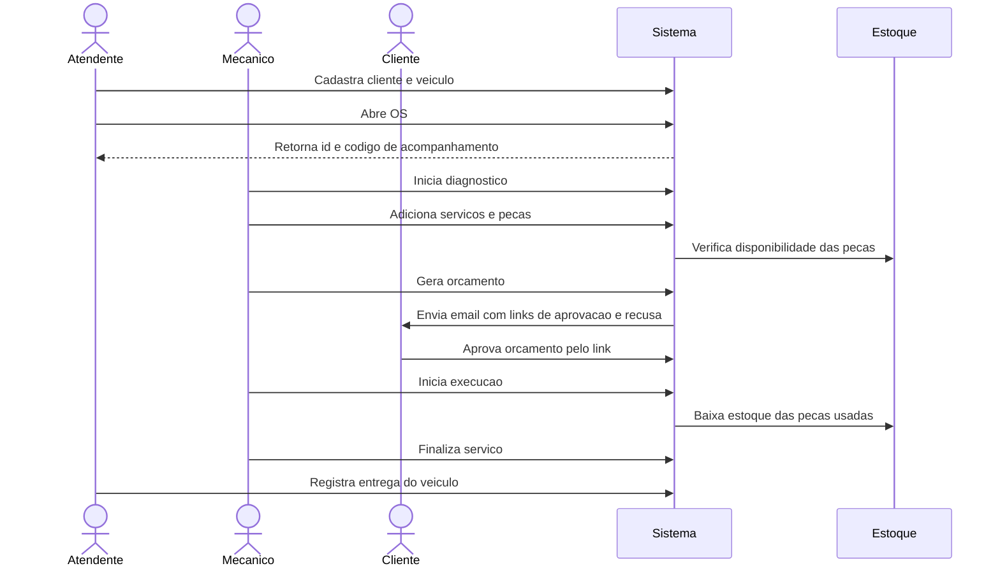
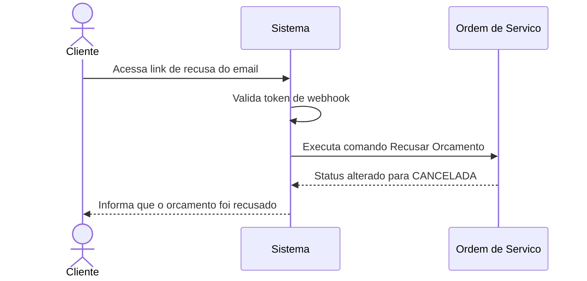
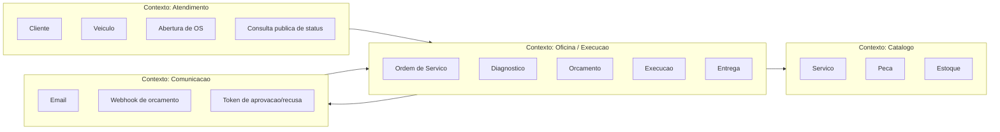
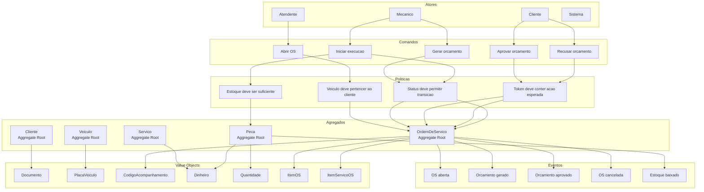

# Modelagem DDD - Fase 2

Este documento complementa o board de Miro e registra no repositorio o raciocinio
de descoberta do dominio usado para evoluir o sistema da oficina na Fase 2.

O objetivo e deixar explicitos:

- Domain Storytelling;
- Event Storming;
- contextos delimitados;
- agregados, atores, comandos, eventos e politicas;
- evolucao dos diagramas da Fase 1 para a Fase 2.

## Linguagem ubiqua

| Termo | Significado no dominio |
|---|---|
| OS | Ordem de Servico aberta para atendimento de um veiculo |
| Codigo de acompanhamento | Codigo publico usado pelo cliente para consultar o status da OS |
| Diagnostico | Etapa em que a oficina entende o problema e prepara o orcamento |
| Orcamento | Soma dos servicos e pecas necessarios para executar a OS |
| Aprovacao | Aceite do cliente para a oficina iniciar a execucao |
| Recusa | Decisao do cliente de nao aprovar o orcamento, cancelando a OS |
| Execucao | Etapa em que os servicos aprovados sao realizados |
| Entrega | Encerramento operacional quando o veiculo e devolvido ao cliente |
| Estoque | Quantidade disponivel de pecas para uso nas OS |

## Evolucao da modelagem

Na Fase 1, a modelagem cobria o fluxo basico da OS:

```txt
RECEBIDA -> EM_DIAGNOSTICO -> AGUARDANDO_APROVACAO -> EM_EXECUCAO -> FINALIZADA -> ENTREGUE
```

Na Fase 2, a descoberta do dominio mostrou tres necessidades novas:

- abrir OS ja com servicos e pecas opcionais;
- permitir que o cliente aprove ou recuse o orcamento por link externo;
- listar o trabalho ativo da oficina por prioridade operacional.

Com isso, o fluxo evoluiu para incluir recusa de orcamento:

```txt
RECEBIDA -> EM_DIAGNOSTICO -> AGUARDANDO_APROVACAO -> EM_EXECUCAO -> FINALIZADA -> ENTREGUE
                                      |
                                      v
                                  CANCELADA
```

`CANCELADA` e estado terminal. Uma OS cancelada nao volta para diagnostico,
execucao, finalizacao ou entrega.

## Domain Storytelling

### Historia principal - Abertura e execucao de OS



### Historia alternativa - Recusa do orcamento



## Contextos delimitados



### Responsabilidades por contexto

| Contexto | Responsabilidade | Principais artefatos no codigo |
|---|---|---|
| Atendimento | Cadastro de cliente/veiculo, abertura e consulta publica da OS | `Cliente`, `Veiculo`, `CriarOrdemDeServicoUseCase`, `ConsultarStatusOSUseCase` |
| Oficina / Execucao | Ciclo de vida da OS, diagnostico, orcamento, execucao e entrega | `OrdemDeServico`, `StatusOS`, use cases do fluxo de OS |
| Catalogo | Servicos, pecas e disponibilidade de estoque | `Servico`, `Peca`, `QuantidadeEstoque`, repositorios de catalogo |
| Comunicacao | Notificacao por email e entrada publica por token | `NotificacaoPort`, `EmailAdapter`, `OrcamentoWebhookTokenPort`, `WebhookOrcamentoController` |

## Event Storming

### Atores

| Ator | Papel |
|---|---|
| Atendente | Cadastra cliente/veiculo, abre OS e registra entrega |
| Mecanico | Diagnostica, informa servicos/pecas, executa e finaliza o servico |
| Cliente | Consulta status, aprova ou recusa o orcamento |
| Sistema | Orquestra regras, valida transicoes, emite tokens e persiste estado |
| Estoque | Representa disponibilidade das pecas |

### Linha do tempo de eventos

```mermaid
flowchart LR
    A["Cliente cadastrado"] --> B["Veiculo cadastrado"]
    B --> C["OS aberta"]
    C --> D["Diagnostico iniciado"]
    D --> E["Servico adicionado"]
    E --> F["Peca adicionada"]
    F --> G["Orcamento gerado"]
    G --> H["Orcamento enviado para aprovacao"]
    H --> I{"Cliente decide"}
    I -->|aprova| J["Orcamento aprovado"]
    J --> K["Execucao iniciada"]
    K --> L["Estoque baixado"]
    L --> M["Servico finalizado"]
    M --> N["Veiculo entregue"]
    I -->|recusa| O["Orcamento recusado"]
    O --> P["OS cancelada"]
```



### Comandos, eventos e politicas

| Comando | Ator | Agregado afetado | Evento gerado | Politicas/regras |
|---|---|---|---|---|
| Cadastrar cliente | Atendente | Cliente | Cliente cadastrado | Documento deve ser valido e unico |
| Cadastrar veiculo | Atendente | Veiculo | Veiculo cadastrado | Veiculo pertence a um cliente existente |
| Abrir OS | Atendente | OrdemDeServico | OS aberta | Cliente e veiculo devem existir; veiculo deve pertencer ao cliente |
| Iniciar diagnostico | Mecanico | OrdemDeServico | Diagnostico iniciado | Status deve ser RECEBIDA |
| Adicionar servico | Mecanico | OrdemDeServico | Servico adicionado | Servico deve existir; preco e copiado como snapshot |
| Adicionar peca | Mecanico | OrdemDeServico | Peca adicionada | Peca deve existir; estoque deve ser suficiente |
| Gerar orcamento | Mecanico | OrdemDeServico | Orcamento gerado | OS deve estar em diagnostico e possuir servico |
| Enviar orcamento | Sistema | OrdemDeServico | Orcamento enviado | Orcamento deve estar gerado; email gera tokens de aprovacao/recusa |
| Aprovar orcamento | Cliente | OrdemDeServico | Orcamento aprovado | Token deve ser valido e acao deve ser `aprovar` |
| Recusar orcamento | Cliente/Atendente | OrdemDeServico | OS cancelada | Status deve ser AGUARDANDO_APROVACAO; estado final CANCELADA |
| Iniciar execucao | Mecanico | OrdemDeServico/Peca | Execucao iniciada; estoque baixado | Orcamento aprovado; estoque ainda suficiente |
| Finalizar servico | Mecanico | OrdemDeServico | Servico finalizado | Status deve ser EM_EXECUCAO |
| Entregar veiculo | Atendente | OrdemDeServico | Veiculo entregue | Status deve ser FINALIZADA |

## Diagrama de agregados



## Regras de consistencia dos agregados

### OrdemDeServico

`OrdemDeServico` e o agregado central. Ele protege as invariantes do fluxo:

- uma OS so muda de status por transicoes validas;
- orcamento so pode ser enviado se ja foi gerado;
- execucao so pode iniciar se o orcamento foi aprovado;
- OS cancelada, finalizada ou entregue nao aparece na listagem operacional;
- servicos e pecas ficam como snapshots dentro da OS para preservar historico.

### Peca

`Peca` controla o estoque disponivel:

- estoque nao pode ficar negativo;
- baixa de estoque acontece ao iniciar execucao;
- a OS guarda o snapshot do preco da peca, mas a disponibilidade continua sendo
  validada no agregado `Peca`.

### Cliente e Veiculo

`Cliente` e `Veiculo` ficam separados para manter cadastro e ciclo de OS
desacoplados:

- documento pertence ao cliente;
- placa pertence ao veiculo;
- a abertura da OS valida o vinculo entre cliente e veiculo.

## Politicas de dominio

| Politica | Onde aparece no codigo |
|---|---|
| Validar vinculo cliente/veiculo antes de abrir OS | `CriarOrdemDeServicoUseCase` |
| Validar estoque ao adicionar peca inicial ou peca na OS | `CriarOrdemDeServicoUseCase`, `AdicionarPecaOSUseCase` |
| Baixar estoque somente ao iniciar execucao | `IniciarExecucaoUseCase` |
| Impedir transicoes invalidas da OS | `OrdemDeServico.transicionar()` |
| Enviar notificacao ao colocar OS aguardando aprovacao | `EnviarOrcamentoParaAprovacaoUseCase` |
| Validar acao do token no webhook | `WebhookOrcamentoController` |
| Excluir OS encerradas da fila operacional | `ListarOrdensDeServicoUseCase` |

## Relacao com Clean Architecture

Os diagramas de dominio acima explicam por que o codigo foi separado em:

- `domain/`: agregados, value objects, erros e contratos de repositorio;
- `application/`: comandos/casos de uso e politicas de orquestracao;
- `infrastructure/`: persistencia, email e token JWT;
- `interfaces/`: controllers HTTP, DTOs e guards.

Essa separacao evita que a descoberta do dominio fique presa a detalhes de
framework, banco ou transporte HTTP.

## Pontos de revisao cobertos

- Domain Storytelling documentado no repositorio;
- Event Storming expandido com atores, comandos, eventos e politicas;
- contextos delimitados separados;
- diagrama de agregados com interacoes;
- evolucao do fluxo da OS entre Fase 1 e Fase 2;
- ligacao entre modelagem e implementacao atual.
